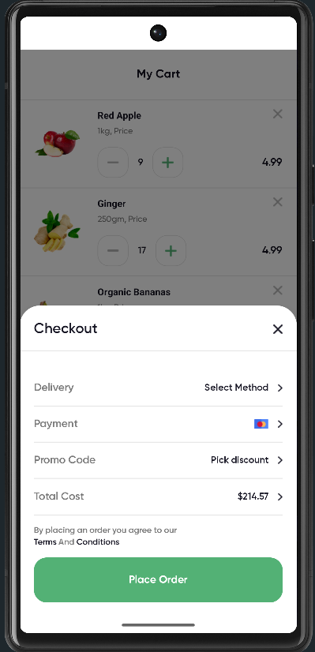
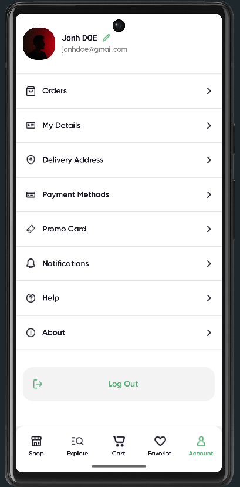

# Groceries Online App | React Native & Expo

[](https://expo.dev/)
[](https://reactnative.dev/)
[](https://tailwindcss.com/)

Une application mobile de commerce de proximité moderne, fluide et performante, développée avec **React Native** et l'écosystème **Expo**. Ce projet démontre une maîtrise de la gestion d'état complexe, des animations haut de gamme et d'une interface "Pixel Perfect" basée sur une maquette Figma communautaire.

**Maquette de référence :** [Figma Design Link](https://www.figma.com/design/67mlGIK5UmTZdvVD2Ie2MH/Online-Groceries-App-UI--Community-?node-id=1-2&p=f&t=6X8dLVz6iFm7tjFq-0)

---

## Aperçu de l'Interface

|                    Shop & Discovery                     |                       Cart & Checkout                       |                     Account & Profile                      |
| :-----------------------------------------------------: | :---------------------------------------------------------: | :--------------------------------------------------------: |
|  |  |  |
|        _Grille responsive et navigation fluide_         |              _Checkout animé avec Reanimated_               |              _Gestion du profil utilisateur_               |

---

## Fonctionnalités Clés

- **Système de Favoris intelligent** : Ajout en masse vers le panier avec vérification automatique des doublons (`.some()` & `.forEach()`).
- **Panier dynamique** : Gestion des quantités en temps réel et calcul automatique du coût total.
- **Expérience Checkout Premium** : Modale de paiement animée avec effet de flou d'arrière-plan et gestion des zones sécurisées (Safe Area).
- **Interface Adaptive** : Design entièrement responsive s'adaptant aux différentes tailles d'écrans (Smartphones & Tablettes).
- **Navigation Native** : Utilisation d'Expo Router pour une navigation fluide basée sur le système de fichiers.

---

## Stack Technique

- **Framework** : [Expo](https://expo.dev/) (SDK récent) & React Native.
- **Langage** : TypeScript pour un code robuste et typé.
- **Gestion d'état** : [Zustand](https://github.com/pmndrs/zustand) (Store global léger et performant).
- **Stylisation** : [NativeWind](https://www.nativewind.dev/) (Tailwind CSS pour mobile).
- **Animations** : [React Native Reanimated](https://www.swmansion.com/reanimated) (60 FPS garantis).
- **Icônes & Assets** : Intégration sur mesure depuis Figma.

---

## Architecture du Projet

Le projet suit les meilleures pratiques de structure de dossiers pour une scalabilité maximale :

```text
├── app/              # Routes Expo Router (Navigation)
├── components/       # Composants UI atomiques et organisés
│   ├── order/        # Logique de commande (CheckoutOrder, etc.)
│   ├── ui/           # Composants de base réutilisables (Buttons, Cards)
├── constants/        # Données statiques, thèmes et images
├── store/            # État global avec Zustand
└── assets/           # Ressources visuelles
```

---

## Installation et Lancement

1. Clonez le dépôt :

```bash
git clone [https://github.com/votre-username/groceries-app.git](https://github.com/votre-username/groceries-app.git)
```

2. Installez les dépendances :

```bash
npm install
```

3. Lancez l'application :

```bash
npx expo start
```

---

## Défis Techniques Relevés

Lors de ce développement, j'ai mis un accent particulier sur :

1.  **La Responsivité** : Refonte des écrans Login/Signup et du composant ProductCard pour assurer une largeur optimale sur iOS et Android.
2.  **La Performance des listes** : Optimisation du rendu des produits via FlatList avec défilement horizontal.
3.  **L'UX Mobile** : Implémentation de retours visuels immédiats après chaque action utilisateur (ajout au panier, validation de commande).
